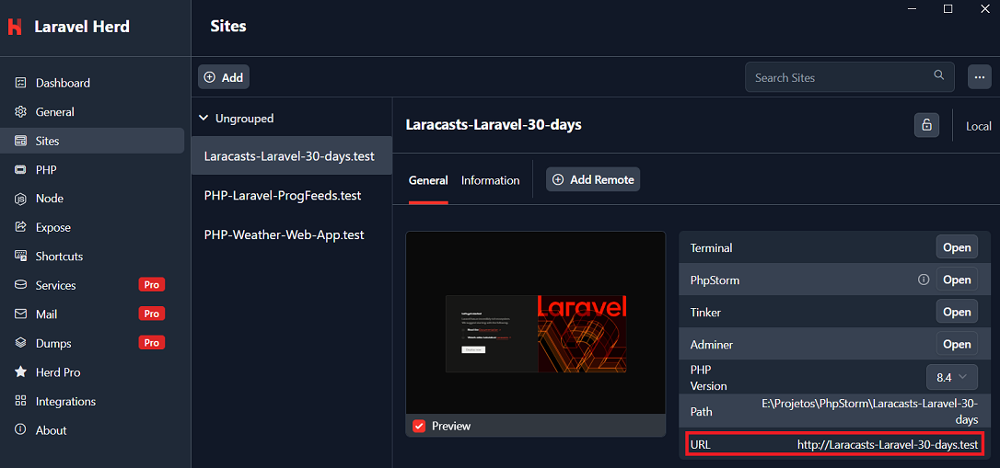

# Laracast - 30 dias para aprender Laravel

## Execução do Projeto
Uma das maneiras de executar o projeto é:
1. Instalar o **Laravel Heard**;
2. Ir na seção **Sites**;
3. Clicar em **Add** e apontar o diretório do projeto;
4. Clicar na URL fornecida (http://laracasts-laravel-30-days.test/).

## Episódios da Série
**Passos de Bebê (7)**

1 - Olá, Laravel - 8m 39s

2 - Sua Primeira Rota e View - 6m 48s

3 - Criando um Arquivo de Layout Usando Componentes do Laravel - 11m 29s

4 - Criando um Layout Bonito Usando TailwindCSS - 12m 39s

5 - Estilizando o Link de Navegação Ativo - 13m 42s

6 - Dados da View e Wildcards de Rota - 20m 02s

7 - Autoloading, Namespaces e Models - 14m 02s

**Eloquent (8)**

8 - Introdução às Migrações - 17m 00s

9 - Conheça o Eloquent - 18m 16s

10 - Fábricas de Modelos - 19m 16s

11 - Dois Tipos de Relacionamento Chave do Eloquent - 7m 47s

12 - Tabelas Dinâmicas e Relacionamentos BelongsToMany - 14m 28s

13 - Carregamento antecipado e o problema N+1 - 10m 35s

14 - Tudo o que você precisa saber sobre paginação - 13m 06s

15 - Entendendo os seeders de banco de dados - 7m 49s

**Formulários (4)**

16 - Formulários e CSRF explicados (com exemplos) - 23m 52s

17 - Sempre valide. Nunca confie no usuário. - 13m 49s

18 - Editando, Atualizando e Excluindo um Recurso - 20m 31s

19 - Rotas Recarregadas - 6 Dicas Essenciais - 16m 33s

**Autenticação (4)**

20 - Kits Iniciais, Breeze e Middleware - 12m 28s

21 - Criando um Sistema de Login e Cadastro do Zero: Parte 1 - 17m 49s

22 - Criando um Sistema de Login e Cadastro do Zero: Parte 2 - 23m 50s

23 - 6 Passos para Dominar a Autorização - 22m 53s

**Aprofundando (3)**

24 - Como Visualizar e Enviar E-mails Usando Classes Mailable - 13m 37s

25 - Filas São Mais Fáceis do que Você Imagina - 15m 48s

26 - Organize Seu Processo de Build - 11m 04s

**Projeto Final (4)**

27 - Do Design ao Blade - 20m 25s

28 - Técnicas de Blade e Tailwind para suas Views do Laravel - 23m 53s

29 - Jobs, Tags, TDD, Oh Meu Deus! - 34m 45s

30 - O Episódio Completo - 43m 50s

## Referências
Laracast - 30 Days to Learn Laravel:
https://laracasts.com/series/30-days-to-learn-laravel-11
