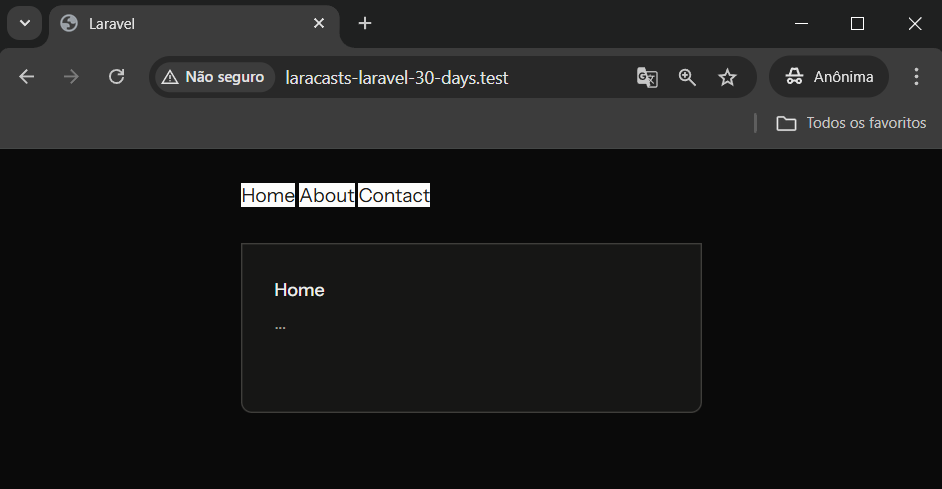

# Day 3 - Create a Layout File Using Laravel Components

## Information
- Manually adding navigation between pages is not a scalable approach, and it will be lost when switching pages.
- To avoid manually typing URLs in the address bar, use a simple navigation bar at the top of each page.
- To avoid code duplication, Laravel provides layout files and components for reusing markup.
- Components should be created in **resources/views/components/**.
- To use Blade, rename your view files to include the `.blade.php` suffix.
- To use a 'name' component, use `<x-name></x-name>`.
- The `x-` prefix ensures that the component tag is unique and does not conflict with standard HTML tags.
- Instead of writing `echo` commands in PHP, Blade allows you to use double curly braces `{{ $slot }}`.
- Writing `{{ $slot }}` is equivalent to `<?php echo $slot; ?>`, but it's cleaner.


## Activities
- Change the view from `welcome` to `home`:
  * In **resources/views**: I changed the file name from `welcome.blade.php` to `home.blade.php`;
  * In **routes/web.php**: I changed the view name from `welcome` to `home` on the route `/`:
  ```php
  Route::get('/', function () {
    return view('home');
  });
  ```
- Add navigation menu between pages:
  * I added the following code to the `header` of the `.blade.php` files:
```html
<nav>
<a href="/" class="bg-[#FDFDFC] text-[#1b1b18]">Home</a>
<a href="/about" class="bg-[#FDFDFC] text-[#1b1b18]">About</a>
<a href="/contact" class="bg-[#FDFDFC] text-[#1b1b18]">Contact</a>
</nav>
```
- Use the common layout as a component:
  * In **resources/views/components**: I created the file `layout.blade.php`;
  * In **resources/views/components/layout.blade.php**:
    * I added the common content from the `.blade.php` files;
    * I added `<h1>{{ $slot }}</h1>` to the `body` of the file.
  * In **resources/views** for `home.blade.php`, `about.blade.php`, and `contact.blade.php`:
    * I removed all the content from the files
    * I added the code replacing "Name" with the page name (home, about, contact):

```html
<x-layout>Name</x-layout>
```




## References
https://laracasts.com/series/30-days-to-learn-laravel-11/episodes/3
