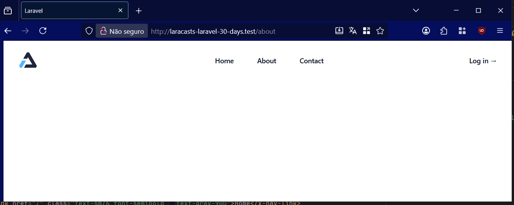

# Day 4 - Creating a Beautiful Layout Using TailwindCSS

## Information
- Blade components in Laravel have access to a `$attributes` object.
- `$attributes` contains all the attributes passed to the component, such as `href`, `id`, or `class`.
- `$attributes` inside a component is used for its tags.

```php
<x-navlink href="/" style="color: white;">Home</x-navlink>
```

```php
<a {{ $attributes }}>
    {{ $slot }}
</a>
```

- Real-world navigation links often require conditional styles or behaviors based on the current page, screen size, or other factors.
- Extracting this logic into a single navlink component helps isolate complexity and makes your code easier to maintain.
- Tailwind CSS, a utility-focused CSS framework that allows you to quickly create layouts without having to write custom CSS files.
- If you don't have Tailwind configured with your build tools, you can include it via CDN by adding this script tag to your layout `<head>`:

```html
<script src="https://cdn.jsdelivr.net/npm/@tailwindcss/browser@4"></script>
```

- Remove any unnecessary parts of the Tailwind UI markup that you don't need, such as extra menu bars or profile sections.
- If you try to use a variable without defining it, Laravel will throw an error; therefore, you must pass it explicitly.
- Named slots can be defined using `<x-slot>`:

```html
<x-slot name="nomed">Value<x-slot>
```

```php
{{ $nomed }}
```

- To obtain the Tailwind component code (free and paid): https://tailwindcss.com/plus/ui-blocks]


## Activities
- Create and use the nav-link component:
  * In **resources/views/components**: I created the file `nav-link.blade.php`
```html
<a {{$attributes}}> {{$slot}} </a>
```
-  * In **resources/views/components/layout.blade.php**: I replaced the `<a>` tags with `<x-nav-link>`:

```html
<nav>
    <x-nav-link href="/" class="bg-[#FDFDFC] text-[#1b1b18]">Home</x-nav-link>
    <x-nav-link href="/about" class="bg-[#FDFDFC] text-[#1b1b18]">About</x-nav-link>
    <x-nav-link href="/contact" class="bg-[#FDFDFC] text-[#1b1b18]">Contact</x-nav-link>
</nav>
```

- Using a Tailwind template to improve the interface:
  * In **resources/views/layout.blade.php**: I pasted the code obtained from the
    [example headers](https://tailwindcss.com/plus/ui-blocks/marketing/elements/headers),
    removed unnecessary parts, and adapted it.
  * In **resources/views/layout.blade.php**: I also replaced the Tailwind logo with the Laracast logo:

```html

```
to
```html

```




## References
https://laracasts.com/series/30-days-to-learn-laravel-11/episodes/4

https://tailwindcss.com/

https://tailwindcss.com/plus

