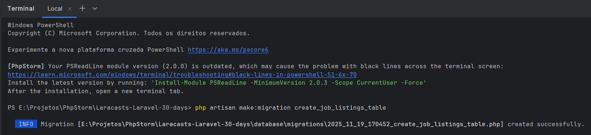
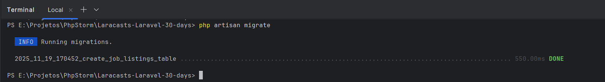

# Day 8 - Introduction to Migrations

## Information

### Database Configuration and Installation
- By default, Laravel selects SQLite, a file-based database that is suitable for many applications,
unless you expect massive scalability like Google or Amazon.

- The `.env` file, which contains environment-specific settings:
  * database credentials;
  * debug mode;
  * cache drivers;
  * API keys.
- This file keeps confidential information out of your source code and version control.


### Artisan Commands and Database Migrations
- **Artisan** is a command-line tool included with Laravel:
  * `php artisan` to list available commands;
  * database-related commands belong to the `db` and `migratedb` namespaces
  * `php artisan migrate` to run all pending migrations, and create or update database tables.
  * `php artisan migrate:refresh` to revert all migrations and run them (useful in development).
  * `php artisan migrate:rollback` to revert the last batch of migrations.

- **Migrations**:
  * are PHP classes that define the structure of your database tables;
  * allow you to control the versions of your database schema and share it with your team;
  * define the database structure in PHP and support version control;
  * contain two methods:
    * up() - defines the changes to be applied (table creation, column addition);
    * down() - defines how to revert these changes (delete tables, remove columns).


### TablePlus for database management
- TablePlus:
  * is a recommended GUI tool for managing databases on macOS, Windows, and Linux;
  * supports various database types, including SQLite, MySQL, and PostgreSQL;
  * It can be connected to your Laravel SQLite database by pointing it to the `database/database.sqlite` file;
  * It allows you to inspect tables, view data, and visually modify the schema.


## Activities
- Check if the `.env` file has `DB_CONNECTION=sqlite`.
- Create a new migration with `php artisan make:migration create_job_listings_table`.



- Edit the migration file to define the table schema with the columns *id*, *title*, and *salary*.
```php
<?php

use Illuminate\Database\Migrations\Migration;
use Illuminate\Database\Schema\Blueprint;
use Illuminate\Support\Facades\Schema;

return new class extends Migration
{
    public function up(): void
    {
        Schema::create('job_listings', function (Blueprint $table) {
            $table->id();
            $table->string('title');
            $table->string('salary');
            $table->timestamps();
        });
    }

    public function down(): void
    {
        Schema::dropIfExists('job_listings');
    }
};
```
- Apply the migration: `php artisan migrate.`




## References
https://laracasts.com/series/30-days-to-learn-laravel-11/episodes/8
