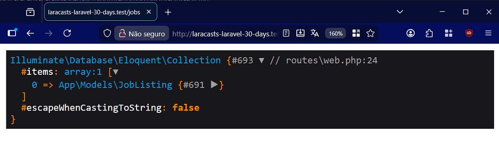

# Day 9 - Meet Eloquent

## Information
- Eloquent:
  * is an ORM (Object-Relational Mapper);
  * maps database rows to PHP objects;
  * facilitates working with your data in an object-oriented way.
- For example, instead of manually manipulating arrays of job postings,
  you can have a Job object representing each job record with all its attributes and behaviors.

- The `find()` method is used to retrieve a specific record from a Model by ID.
- The `all()` method is used to retrieve all records from a Model.
- If the `all()` method returns an empty collection, check if the database table name matches the Eloquent conventions.
- By default, Eloquent expects the table name to be the snake_case plural of the model name (jobs for Job).
- If your table has a different name, specify it in the Model class `protected $table = 'table_name;`.

- Record creation:
  * can be done with the `create()` method;
  * is protected against mass assignment vulnerabilities by Laravel,
  preventing malicious users from modifying unintentional fields;
  * has its fields allowed with mass assignment if they are in the array in the `$fillable` property in the Model class.

- The `dd()` function is used to inspect an object and display it in place of a view, for testing purposes only.
- To access a field of an object in a collection:
  * use `[0]` to access the first element
  * and then `->` followed by the field name.
```php
$jobs[0]->title;
```

- Laravel Tinker:
  * is an interactive shell application (REPL) for your application;
  * is used to test Eloquent queries, create records, update data, and much more;
  * is executed after the `php artisan tinker` command;
  * has the `php artisan make:model Post -m` command to generate the Model and migration.

- To generate models and their respective migrations, use Artisan with the command `php artisan make:model ModelName -m`.


## Activities
- To convert your existing `Job` class into an Eloquent model:
  * rename the file and the class name to `JobListing`;
  * make the `JobListing` class extend the `Model` class;
  * remove the `all()` and `find()` methods, as they will be generated automatically;

```php
<?php

namespace App\Models;
use Illuminate\Database\Eloquent\Model;

class JobListing extends Model
{
    protected string $id;
    protected string $title;
    protected string $salary;
    protected $table = 'job_listings';
    protected $fillable = ['title', 'salary'];

}
```

- In the `routes/web.php` file, I created the `/jobs` route and used the `dd()` function to inspect `JobListing::all()`.
```php
Route::get('/jobs', function () {
    $jobs = JobListing::all();
    return dd($jobs);
});
```

- I added a record using the code:
```php
JobListing::create([
    'title' => 'Acme Director',
    'salary' => '1000000',
]);
```

- I tested the result of the `jobs` route: `http://laracasts-laravel-30-days.test/jobs`




## References
https://laracasts.com/series/30-days-to-learn-laravel-11/episodes/9
