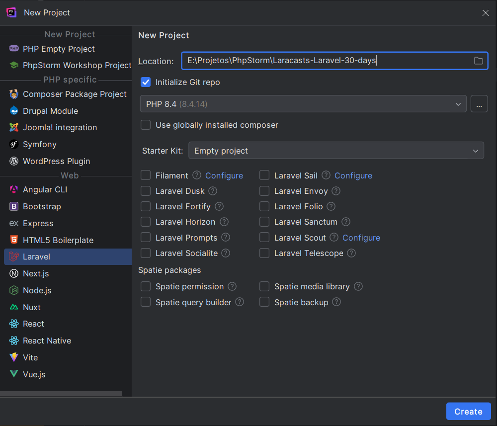

# Dia 01 - Olá, Laravel

## Ecossistema de Desenvolvimento Web com PHP
O ecossistema do PHP é amplo:
* Servidores Web: Apache, Nginx;
* Pacotes de Desenvolvimento: XAMPP, WAMP, MAMP, Laragon;
* Frameworks e Ferramentas: Laravel, CodeIgniter, Yii, CakePHP, Symfony;
* Gerenciador de dependências: Composer;
* CMS (Sistemas de Gerenciamento de Conteúdo): WordPress, Drupal, Joomla
* Plataformas de E-commerce: Magento, OpenCart, PrestaShop, WooCommerce (plugin para WordPress), 
Bagisto (baseado em Laravel);

## Configurações do Projeto
As ferramentas e suas versões utilizados no desenvolvimento foram: 
* PHP 8.4;
* Laravel 12;
* Laravel Heard 1.22.3;
* PHP Storm 2025.2.4;

## Referências
https://laracasts.com/series/30-days-to-learn-laravel-11/episodes/1
