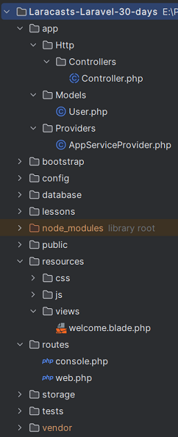
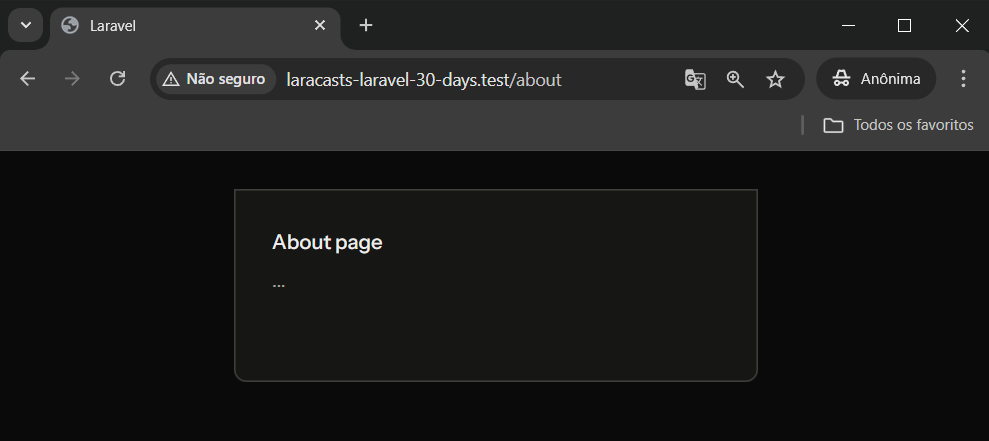
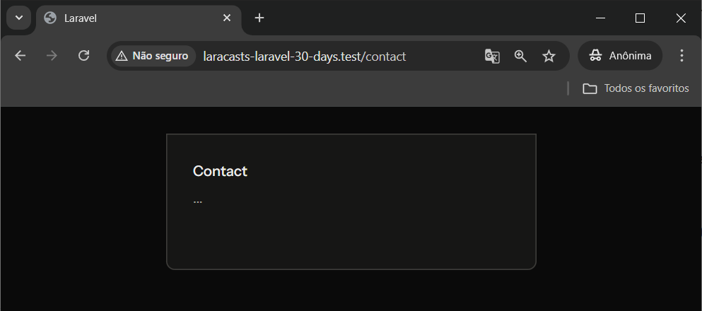

# Dia 2 - Sua Primeira Rota e View

## Informações
- Em **routes/web.php** as rotas das aplicações e os seus respectivos retornos são definidos.
- O retorno de uma rota pode ser: 
  - uma função callback que retorna um arquivo de view, uma string (mensagem), um array (json);
  - a referência de um método de uma Controller.
- Blade é o mecanismo de templates do Laravel.
- A extensão de arquivos Blade é `.blade.php`. 
- A estrutura de pasta do projeto é: 



- Para criar uma rota:
  - Em **routes/web.php**, adicione:
    ```php
    Route::get('/route_name', function (){
        return view('view_name');
    });
    ```
   - Em **resources/views**, crie o arquivo `view_name.blade.php`. 


## Atividades
- Criar uma página em `/about`:
  - Em **routes/web.php**, eu adicionei:
    ```php
    Route::get('/about', function (){
        return view('about');
    });
    ```
  - Em **resources/views** criei o arquivo `about.blade.php`
  - No navegador eu testei a URL http://laracasts-laravel-30-days.test/about




- Criar uma página em `/contact`:
    - Em **routes/web.php**, eu adicionei:
      ```php
      Route::get('/contact', function (){
          return view('contact');
      });
      ```
    - Em **resources/views** criei o arquivo `contact.blade.php`
    - No navegador eu testei a URL http://laracasts-laravel-30-days.test/contact




## Referências
https://laracasts.com/series/30-days-to-learn-laravel-11/episodes/2
